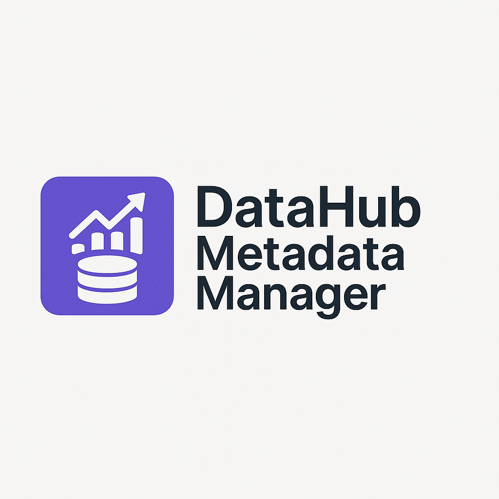

<div align="center">

# 🚀 DataHub Metadata Manager




A comprehensive web application for managing and emitting metadata from Trino tables to DataHub with advanced features like auto-discovery, bulk CSV upload, and smart validation.

</div>

## ✨ Features

### 🔍 **Smart Discovery & Navigation**

- **Catalog/Schema/Table Browsing**: Navigate through Trino catalogs with pagination
- **Auto-Discovery**: Automatically load missing schemas/tables from CSV uploads
- **Smart Validation**: Prevents emission failures by ensuring all dependencies are loaded

### 📝 **Flexible Metadata Management**

- **Manual Entry**: Add metadata with dropdowns for tables, columns, tags, and descriptions
- **CSV Bulk Upload**: Upload comprehensive metadata via CSV with validation
- **Rich Metadata**: Support for domains, owners, table/column tags, and descriptions

### 🎯 **Professional DataHub Integration**

- **Proper Tags**: Creates actual DataHub tags, not just descriptions
- **Domain Association**: Links tables to business domains
- **Ownership Management**: Assigns proper DataHub ownership
- **Schema Validation**: Ensures correct data types and field mappings

### 🛡️ **Robust User Experience**

- **Session Management**: Clean data handling with smart clearing
- **Pagination**: Handle hundreds of tables without performance issues
- **Visual Feedback**: Clear status indicators and progress tracking
- **Error Prevention**: Comprehensive validation and user guidance

### 🔌 **Multi-Connector Support**

- **Current**: Full Trino integration with comprehensive metadata support
- **Coming Soon**: Support for additional data platforms (Snowflake, BigQuery, PostgreSQL, and more)

## 📋 Prerequisites

Before setting up the DataHub Metadata Manager, ensure you have the following components running:

### 🐳 **DataHub (Dockerized Setup)**

DataHub is a modern data discovery and observability platform. You need a running DataHub instance to emit metadata.

**Quick DataHub Setup:**
```bash
# Install DataHub CLI
pip install acryl-datahub

# Start DataHub with Docker Compose (requires Docker)
datahub docker quickstart

# Or use the official Docker Compose setup
git clone https://github.com/datahub-project/datahub.git
cd datahub/docker/quickstart
docker-compose up -d
```

**DataHub will be available at:**
- **Frontend UI**: `http://localhost:9002`
- **GMS API**: `http://localhost:8080` (used by this application)

### 🗄️ **Trino Server**

Trino is a distributed SQL query engine. You need a running Trino server to connect to your data sources.

**Trino Setup Options:**

1. **Docker (Quick Start):**
```bash
docker run -d --name trino -p 8080:8080 trinodb/trino:latest
```

2. **Production Setup:**
   - Follow the [official Trino documentation](https://trino.io/docs/current/installation.html)
   - Configure your data source connectors (Hive, PostgreSQL, MySQL, etc.)
   - Ensure proper security and authentication

3. **Cloud Managed:**
   - AWS EMR with Trino
   - Starburst Enterprise
   - Other managed Trino services

### 🔧 **System Requirements**

- **Python**: 3.7 or higher
- **Docker**: For DataHub setup (recommended)
- **Network Access**: Between this application, Trino, and DataHub
- **Memory**: Minimum 4GB RAM for local development
- **Storage**: Sufficient space for Docker containers and logs

### ✅ **Verification**

Before proceeding, verify your setup:

1. **DataHub**: Access `http://localhost:9002` and see the DataHub UI
2. **Trino**: Connect to your Trino server and run `SHOW CATALOGS`
3. **Network**: Ensure all components can communicate with each other

## 🏗️ Project Structure

```
datahub-metadata-manager/
├── app.py                 # Main Flask application
├── config.py              # Configuration management
├── run.py                 # Application entry point
├── requirements.txt       # Python dependencies
├── sample_metadata.csv    # Example CSV format
├── .env.example          # Environment variables template
├── .gitignore            # Git ignore rules
├── README.md             # This file
├── templates/            # HTML templates
│   ├── base.html         # Base template with styling
│   └── index.html        # Main application interface
└── uploads/              # CSV upload directory
    └── .gitkeep          # Keep directory in git
```

## 🚀 Quick Start

### 1. **Setup Environment**

```bash
# Clone or download the project
cd datahub-metadata-manager

# Create virtual environment
python -m venv venv

# Activate virtual environment
# Windows:
venv\\Scripts\\activate
# Linux/Mac:
source venv/bin/activate

# Install dependencies
pip install -r requirements.txt
```

### 2. **Configure Application**

```bash
# Copy environment template
copy .env.example .env

# Edit .env with your settings
# Update Trino and DataHub connection details
```

### 3. **Run Application**

```bash
# Option 1: Using run.py (recommended)
python run.py

# Option 2: Direct Flask run
python app.py
```

### 4. **Access Application**

Open your browser to: `http://localhost:5000`

## ⚙️ Configuration

### Environment Variables

| Variable | Default | Description |
|----------|---------|-------------|
| `TRINO_HOST` | `0.0.0.0` | Trino server hostname |
| `TRINO_PORT` | `00000` | Trino server port |
| `TRINO_USER` | `user` | Trino username |
| `DATAHUB_GMS` | `http://localhost:8080` | DataHub GMS server URL |
| `DATAHUB_PLATFORM` | `trino` | Platform identifier |
| `DATAHUB_ENV` | `DEV` | Environment (DEV/PROD/etc.) |
| `FLASK_HOST` | `0.0.0.0` | Flask server host |
| `FLASK_PORT` | `5000` | Flask server port |
| `FLASK_DEBUG` | `True` | Enable debug mode |

### CSV Format

Your metadata CSV must contain these columns:

| Column | Required | Description |
|--------|----------|-------------|
| `SchemaName` | ✅ | Name of the schema |
| `Domain` | ❌ | Business domain (optional) |
| `OwnerName` | ❌ | Data owner/designation |
| `TableName` | ✅ | Name of the table |
| `TableDescription` | ❌ | Description of the table |
| `TableTag` | ❌ | Tag for the table |
| `ColumnName` | ✅ | Name of the column |
| `ColumnDescription` | ✅ | Description of the column |
| `ColumnTag` | ❌ | Tag for the column |
| `ColumnDataType` | ❌ | Data type of the column |

See `sample_metadata.csv` for a complete example.

## 🎯 Usage Workflow

### 1. **Load Data Sources**

- **Load Catalogs** → Select catalog → **Load Schemas** → Select schema → **Load Tables**
- Or let auto-discovery handle this when uploading CSV

### 2. **Add Metadata**

- **Manual Entry**: Use dropdowns to select tables/columns and add descriptions/tags
- **CSV Upload**: Bulk upload comprehensive metadata with auto-discovery

### 3. **Review & Validate**

- **View Current Metadata**: See all added metadata with source indicators
- **Test Connections**: Verify Trino and DataHub connectivity
- **Debug Tools**: Use debug features to troubleshoot issues

### 4. **Emit to DataHub**

- **Select Tables**: Choose which tables to emit with visual status indicators
- **Review Summary**: Confirm what will be emitted with detailed preview
- **Emit**: Push metadata to DataHub with proper tags, domains, and ownership

## 🔧 Advanced Features

### **Auto-Discovery**

When uploading CSV with schemas/tables not currently loaded:

- System detects missing items
- Shows dialog with what needs to be loaded
- User confirms and system loads missing schemas/tables
- Immediately ready for emission

### **Smart Validation**

- Prevents emission of tables without proper schema loading
- Validates CSV format and required columns
- Checks DataHub and Trino connectivity
- Provides clear error messages and guidance

### **Session Management**

- Clean data separation between manual and CSV metadata
- Smart clearing that preserves instructions and important UI elements
- Automatic session cleanup on page reload

### **Professional UI**

- Pagination for handling hundreds of tables
- Visual status indicators for table readiness
- Progress tracking and detailed feedback
- Responsive design for different screen sizes

## 🐛 Troubleshooting

### **Common Issues**

1. **CSV Instructions Disappearing**
   - Fixed with auto-restore mechanism
   - Instructions are now bulletproof and always visible

2. **Emission Failures**
   - Use "Test Connections" to verify Trino/DataHub connectivity
   - Check debug logs for detailed error information
   - Ensure all required schemas/tables are loaded

3. **Missing Tables in Emission**
   - Use auto-discovery dialog when uploading CSV
   - Manually load schemas/tables if needed
   - Check that table names match between CSV and Trino

### **Debug Tools**

- **Debug Button**: Shows current metadata state and loaded items
- **Console Logs**: Browser console shows detailed operation logs
- **Test Connections**: Verify Trino and DataHub connectivity
- **Status Indicators**: Real-time display of current application state

## 📊 DataHub Integration

The application creates proper DataHub entities:

- **Domains**: `urn:li:domain:domain_name`
- **Tags**: `urn:li:tag:tag_name`
- **Ownership**: `urn:li:corpuser:owner_name`
- **Datasets**: `urn:li:dataset:(urn:li:dataPlatform:trino,catalog.schema.table,ENV)`

All metadata appears in the correct DataHub sections, not just as documentation.

## 🤝 Contributing

1. Fork the repository
2. Create a feature branch
3. Make your changes
4. Test thoroughly
5. Submit a pull request

## 📄 License

This project is licensed under the MIT License - see the LICENSE file for details.

## 🙏 Acknowledgments

- Built with Flask, Bootstrap, and DataHub Python SDK
- Designed for enterprise-grade metadata management
- Optimized for user experience and reliability

---

**🎉 Ready to manage your DataHub metadata like a pro!**